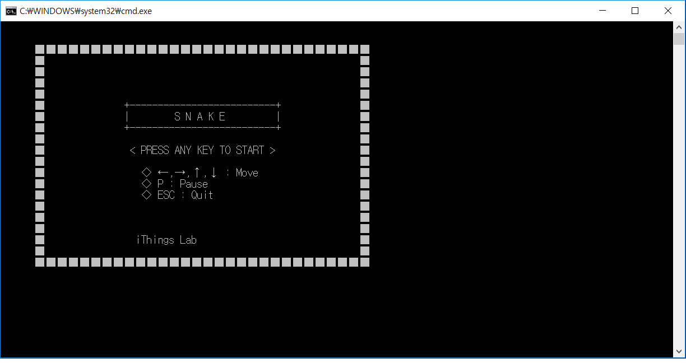
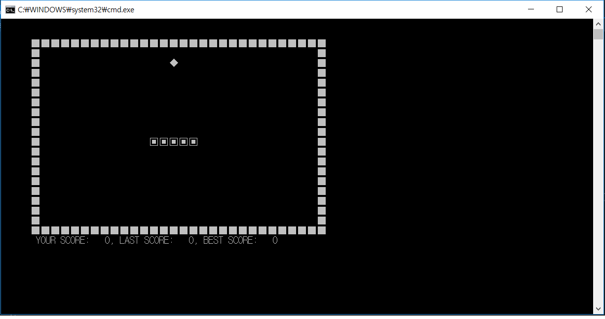
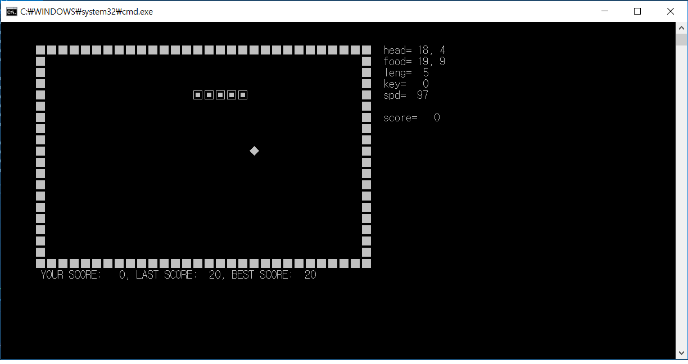
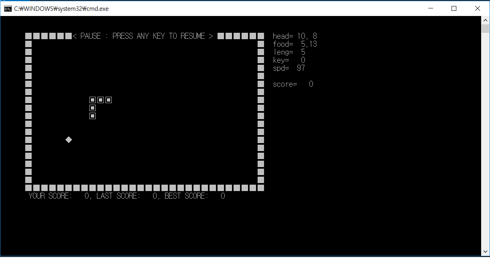
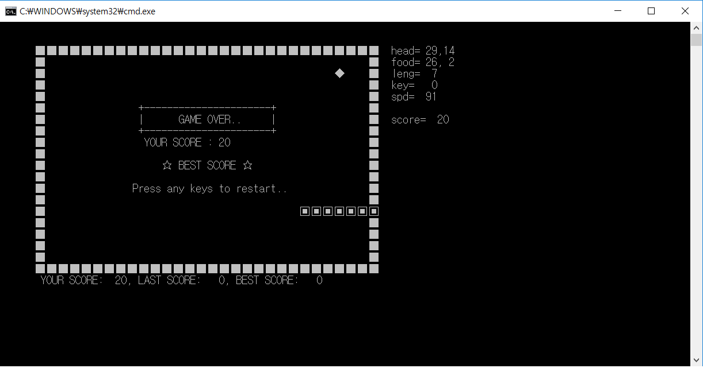

# Snake_game
Snake game for 'Basic Programming2' project.

Here is the Title. It shows explaination about controlling.
===

Next, this is a play screen.
===

Status on.
===

Pause.
===

This screen shows when game is over.
===

This program is currently in development, and here are the things what I will gonna do.
===

First, comments would be added, and ppt file wil be uploaded.

Next, bomb will be added.

Then, I will make levels for this.

Finally, after all of this, our class will make the maze by using what we've learned from the snake game.

<LeeChangYoon 2018. 09. 10>
